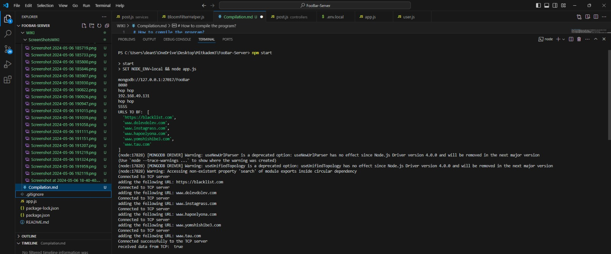

# How to compile the program?
1. Make sure to have the extracted zip of FooBar-Project (the TCP&BloomFilter) on you linux machine. Find your ip in the terminal by 'ifconfig', and replace the TCP_IP in the 'env.local' file in the NODEJS server with your linux IP.
2. Open the project in the terminal and enter the following commands to run the TCP server:

3. Then go to open the NodeJS server repo (extracted zip repo of course), and run the command 'npm start' to run this server.

4. Then run the webApp or the application (the web by the address 'http://localhost:8080/' in you web and the android by entering the project in Android Studio and run the project by the green triangle in the right corner).

